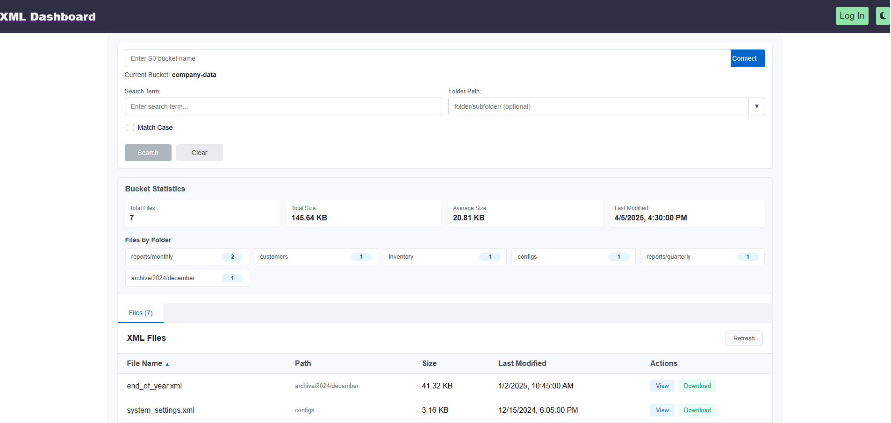
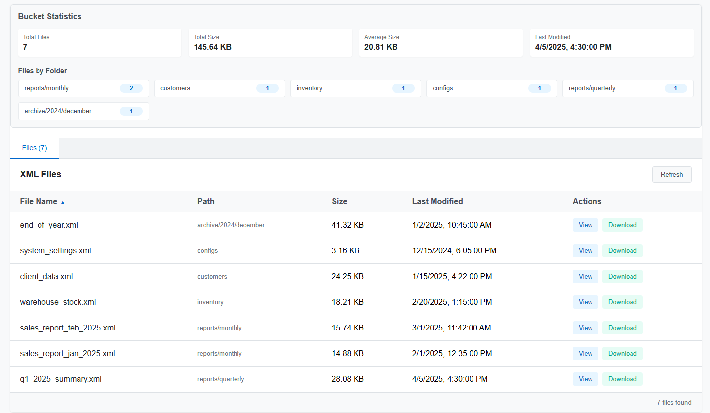
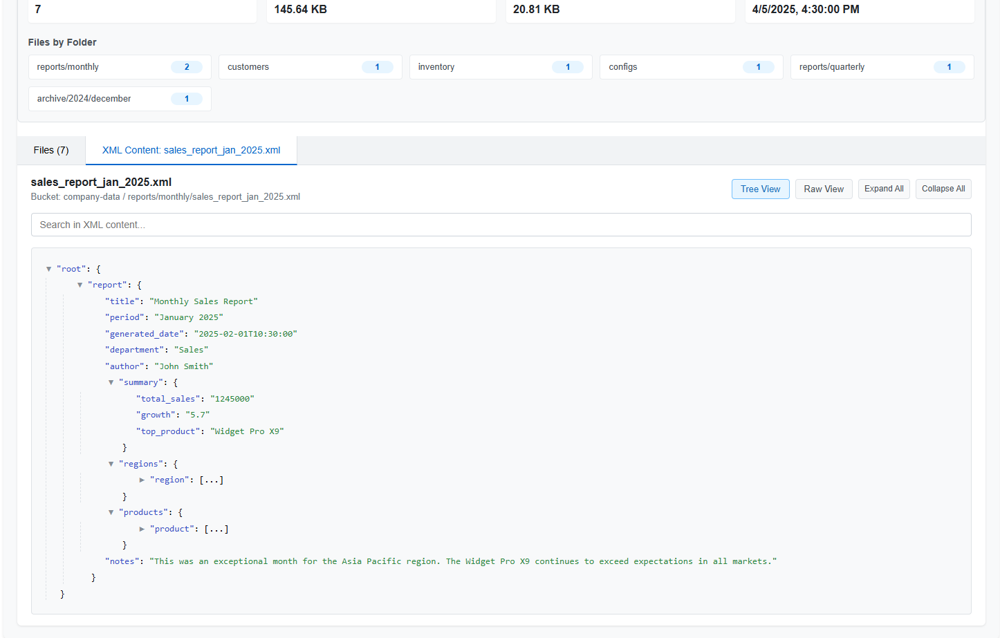
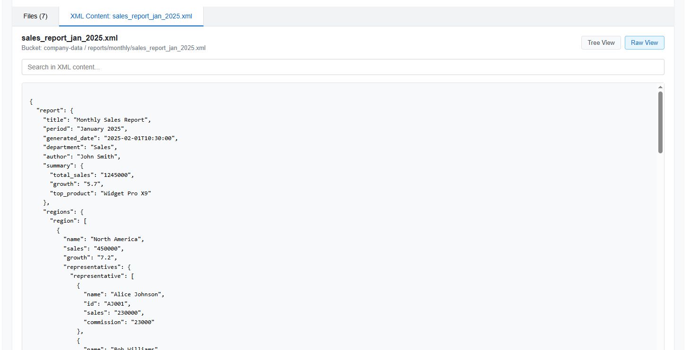

# XML-Dashboard-S3 - S3-based XML file search application

## Frontend: [XML Dashboard S3 - React Frontend](https://github.com/ivaaak/XML-Dashboard-S3/blob/main/frontend/README.md)
## Backend: [XML Dashboard S3 - Express Backend](https://github.com/ivaaak/XML-Dashboard-S3/blob/main/backend/README.md)

**Screenshots:**
</img>
</img>
</img>
</img>

## Backend (Node.js/Express)

- **S3Service**: Core functionality for interacting with S3 buckets and XML files
- **XML Controller**: API endpoints for file operations (list, view, search, download)
- **Routes**: URL structure for the API
- **Server/App Configuration**: Express setup with error handling

## React Frontend

- **Dashboard**: Main container component
- **BucketSelector**: UI for connecting to and selecting S3 buckets
- **SearchBar**: Search interface with folder prefix and case sensitivity options
- **XmlFilesTable**: Table to view files with sorting and filtering
- **SearchResultsTable**: Display search matches with context
- **XmlContentViewer**: View XML files in tree or raw format with search capabilities
- **Supporting Components**: Loading spinner and error messages
- **API Service**: Connection to backend endpoints

## Styles
CSS modules for all components with responsive design.

## Key Features

1. **Bucket Selection**: Connect to any S3 bucket with saved history
2. **XML Content Viewing**: Tree view for easy navigation or raw view for detailed inspection
3. **Advanced Search**: Search within XML content with match highlighting
4. **Responsive Design**: Works on desktop and mobile devices
5. **No Database Required**: Works directly with S3 without needing a database

### Built With:
-  [**✔**]  `React (Vite, Typescript)`
-  [**✔**]  `Express API`
-  [**✔**]  `Auth0`
-  [**✔**]  `Axios`


### Getting Started:

You can run the below commands from the root directory and start the project:
```cmd
npm i
npm start
```
This installs and starts both the FE and BE using the npm tool 'concurrently'. Or you can run the commands separately in the frontend / backend folders to have them running in separate instances/terminals.


### To deploy this application:

1. Set up the backend with proper AWS credentials
2. Configure the frontend to point to your backend API
3. For remote access, set up a VPN as recommended
